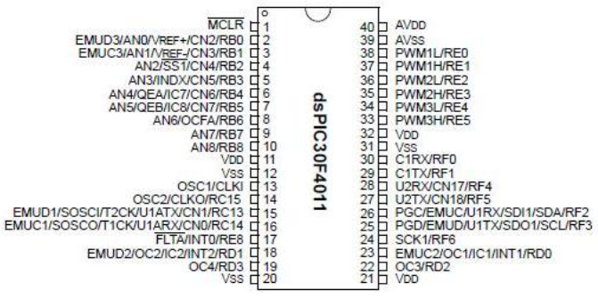
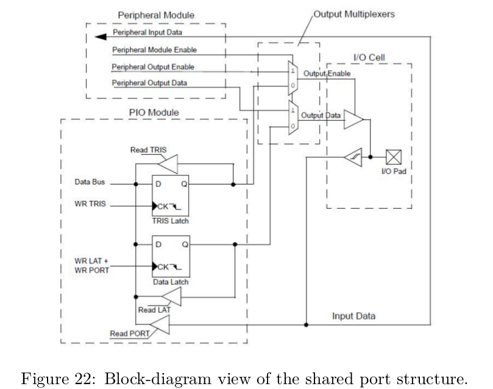
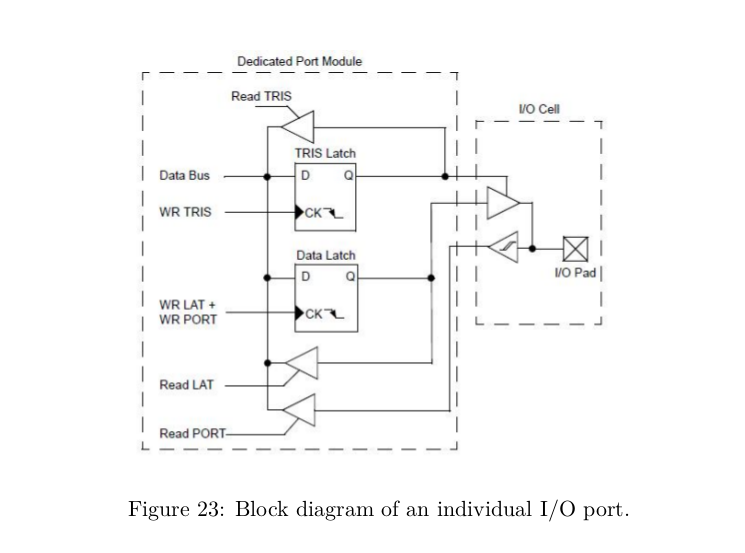
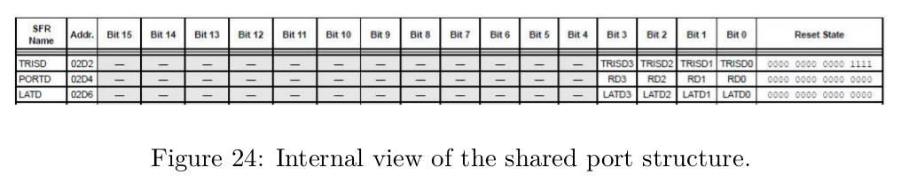

# Digital I/O

- pins are shared between several peripherals
- example when PWM1 peripheral is enabled you cannot use pin 37 and 38 as digital I/o
- disable peripheral if you want to use pin as digital I/O

## Control a port PIN
- **TRIS**
    - 0: port as output
    - 1: port as input (default)
- **PORT**
    - **READ**: logic state of the pin after the Schmitt trigger
    - WRITE: controller will actually set the latch (**LAT**)
- **LATCH**
    - **WRITE**
    - always has the state you have set it to

## I/O Programming
- operations performed by READ and WRITE to **SFRs** associated with the digital I/O pin
- all I/O ports organized in groups of 16 (A,B,C etc.)
- registers are called **TRISD, PORTD and LATD** for port D
- shared port D only controls 4 pins despite having 16x3 bits

- to set tristate bit for bit 2 of port D:
    - TRISDbits.TRISD2 = 1
    - use &, | and a mask in C to set individual bits

## Analogue Side of Digital Ports
| max current by any I/O pin        | 25 mA|
| max combined current by all ports | 200mA|
