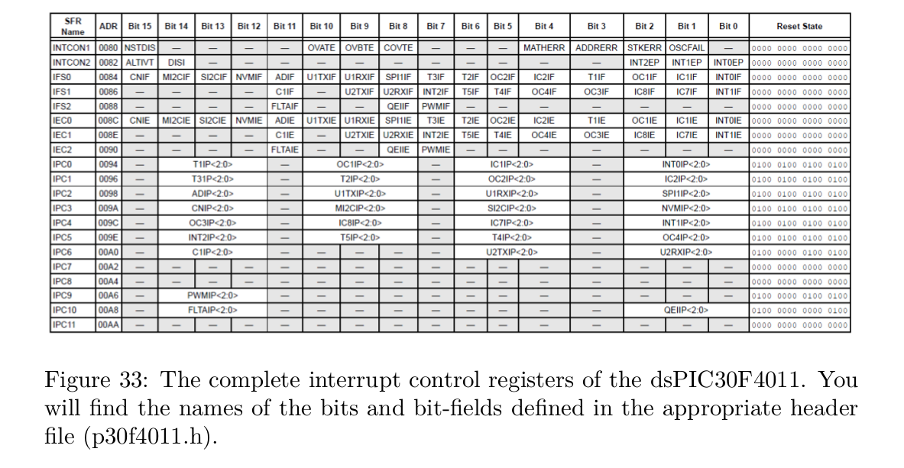
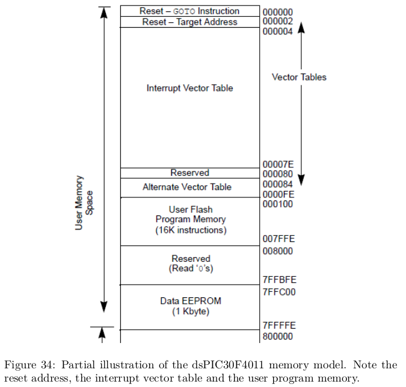
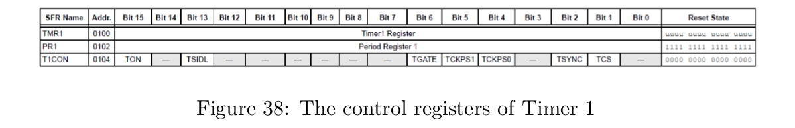

# Exercises
1. Calculate which prescaler TCKPS<1:0> and timer period PR1 you should choose in order to achieve a Timer1 period of 10ms.
2. Create a *.c and *.h file (e.g. Timer1Functions.c, Timer1Functions.h) for all functions associated with Timer1. 

    - Write a function that initialises Timer1 (e.g. timer1Setup()). This setup function should be called in your main function. 
    - Your main function should contain (apart from the setup function calls) only a while(1) loop. 
    - Set up Timer 1 to create an Timer1 interrupt every 10ms and enable Timer 1 interrupts. 
    - Set the interrupt priority to 3. An example of a main() function in shown below:

```C
    int main(void)
    {
        //initialise all necessary modules
        gpIOSetup();
        Timer1Setup();
        //infinite loop
        while(1); //remain here forever, never end the main function.
        return 0; //we should never really return
    }
```

3. Write the Timer1 ISR. Put it in the same file as your Timer1 initialisation function (e.g. Timer1Functions.c). 
    - Toggle LED2 whenever the Timer1 ISR is called. Don’t forget to reset the Timer1 interrupt flag. 
    - Measure with a scope the exact blinking frequency of LED2. Correct your Timer1 configuration if you don’t measure exactly 50Hz. You can also use the MPLABX simulator to measure your cycle time if you don’t have a scope at hand.

4. Implement a software counter in your Timer1 ISR which will allow you to toggle LED3 with exactly 1Hz while LED2 keeps on blinking with a frequency of 50Hz

5. Using the MPLABX simulator, find out where your Timer1 ISR is stored in memory and compare this with the entry in the IVT.

6. Explain the functionality of bit NSTDIS (INTCON1<15>). Why is such a functionality sometimes useful?

7. Extras: Explore Timer2/3 and Timer4/5. Write setup and ISR functions for them. Can you blink LED2 and LED3 from different timers? Change Timer1 trigger an interrupt every 1ms. Using counters within the Timer1 ISR, create three different "‘Container-Functions"’ that are called every 10ms, 50ms and 200ms from your Timer1 ISR. This could form the basis
for an embedded system that would process different "‘task"’ (depending on their time constants) at different cycle times.


# Interrupts
</img>
- **IRQ**: interrupt request triggers if not masked
- **ISR**: interrupt service routine
- **Polling**: actively sampling the status of an external device
- **OR: processing by (hardware) interrupts)** efficient compared to polling


- during normal program: **prio(CPU) = 0**
    - read at **IPL<2:0>** in **SR<7:5>** (status register)

- **IR** with **prio(IR) > prio(CPU) = 0** can interrupt normal program

- if **IR** is running, **prio(CPU)** changes to a higher level (1-7)

- **prio(IR) = 0** disabled IR


## For Programmer
For each interrupt source, these bits exist:
- **T1IF** in **IFSO**
    - timer 1 interrupt flag in interrupt flag register 0
- **T1IE** in **IEC0**
    - timer 1 interrupt enable flag in interrupt control register 0
- **T1IP<2:0>** in **IPCO**
    - timer 1 interrupt priority in interrupt priority register 0

### Initialization Step
1. clear **T1IF**
2. choose **T1IP<2:0>** (1-7)
    - default: T1IP=0b100 (4)
3. set **T1IE** (enable interrupts from T1)



### Loop
1. T1 raises T1IF
2. IF **T1IE** and **T1IP** > 0 = prio(CPU)
    1. STOP normal program
    2. CALL ISR
    3. END ISR
3. RESUME normal program

### Write an ISR: complete list available in C30/XC16 compiler manual
- **Always reset the interrupt flag!**
- **consider using static variables**
- for each peripheral there is at least on dedicated interrupt
- ex. _T1Interrupt, _ADCInterrupt


```C
    void __attribute__((interrupt, auto_psv)) _T1Interrupt(void)
    {
        IFS0bits.T1IF=0; ///reset the timer 1 interrupt flag
        //do something useful here
        //...
        //...
    }
```
## Memory Model


## Timer 1
- TMR1 = TMR1 + 1
- if TMR1 == PR1 (period register)
    - TMR1 = 0


bit | function
----|---------
TON     | timer 1 on bit
TSIDL   | stop in idle mode bit
TCKPS<1:0>| prescalar select bits
TSYNC   | external clock input synchonization bit
TCS     | input clock select bit

### Timer 1 Setup Function
```C
    clear TON               // switch t off during setup
    clear TMR1 register     // reset t to 0
    set TCKPS<1:0>          // choose prescalar 
    set PR1                 // choose period
    clear TCS               // choose internal clock
    TSYNC = x               // ignored when using internal clock
    set TSIDL               // stop t in idle mode
    clear TGATE             // do not gate the timer
    clear T1IF              // clear interrupt flag

    set T1IP<2:0>
    set T1IE
    set TON
```

### Prescalars
- TCKPS<1:0>: choose 1:1, 1:8, 1:64 or 1:256
    - slows down time between increments
    - period of T_cycle is extended by factor 8, 64 or 256.

- TMR1 is only 16 bits => count up to 2^16 - 1 = 65535


