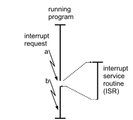
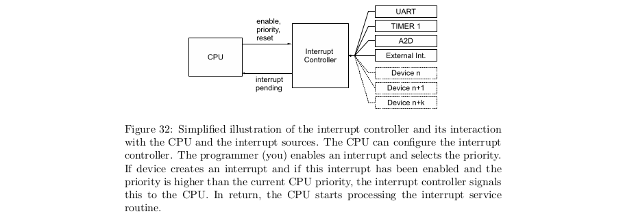

# Interrupts
</img>
- **IRQ**: interrupt request triggers if not masked
- **ISR**: interrupt service routine
- **Polling**: actively sampling the status of an external device
- **OR: processing by (hardware) interrupts)** efficient compared to polling

- during normal program: **prio(CPU) = 0**
    - read at **IPL<2:0>** in **SR<7:5>** (status register)

- **IR** with **prio(IR) > prio(CPU) = 0** can interrupt normal program

- if **IR** is running, **prio(CPU)** changes to a higher level (1-7)

- **prio(IR) = 0** disabled IR

