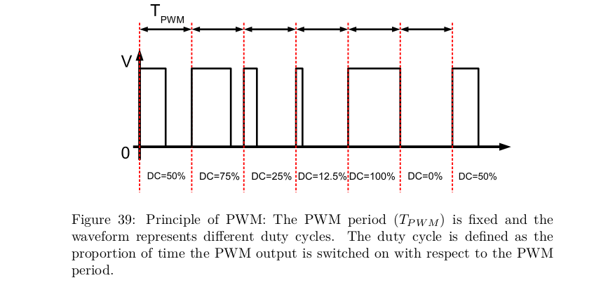

# 5 - Pulse Width Modulation (PWM)

- PWM used to control the amount of energy supplied to an actuator
    - ex. light source or any other device when employing digital control systems
    - require fast switches
        - switches are FETs with a low R_DS(ON)
- amount of power supplied to a load = pulse width modulated

## Exercise

