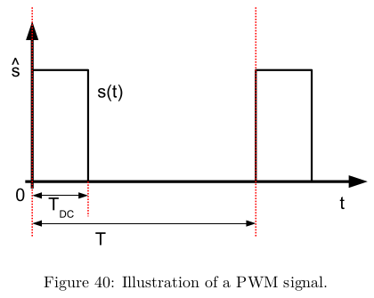
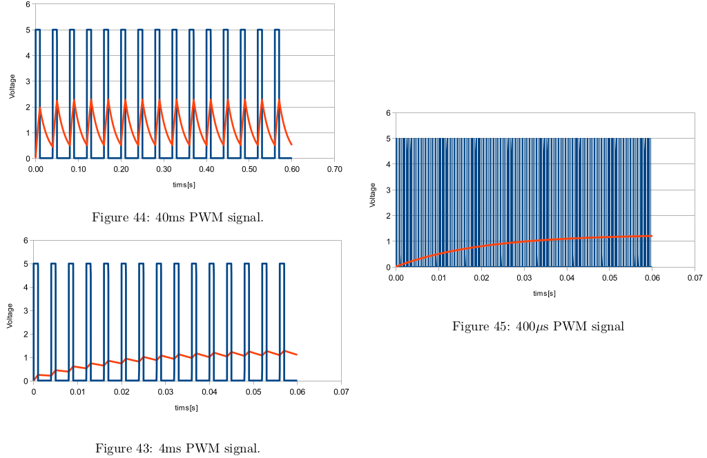
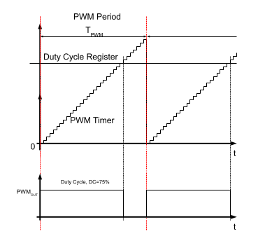
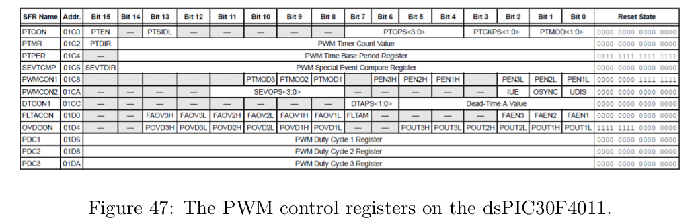

# 5 - Pulse Width Modulation (PWM)

- PWM used to control the amount of energy supplied to an actuator
    - ex. light source or any other device when employing digital control systems
    - require fast switches
        - switches are FETs with a low R_DS(ON)
- amount of power supplied to a load = pulse width modulated




## Calculating
- calculate the average voltage by integrating over the time period T

- s_avg = (T_on x s + T_off x 0) / T

- s_avg = 1/T x T x DC = s_hat x DC

- if frequency too low:
    - load will follow the pulse
- if frequency too high: 
    - might generate large amount of electromagnetic interference with other systems
    - expect high transmission losses

## Choosing PWM period
- PWM choice influences amount of ripple in the resulting signal
- experiment: PWM source driving an RC load
    - we are trying to control the voltage on the capacitor






## PWM Signal Generation
- main elements: timer/counter and a comparator whose outputs drive the PWM signal
- controlling duty cycle by changing the value in the **duty cycle register**
1. PWM signal **ON**
2. comparator: counter value >= **PWM duty cycle value**
3. PWM signal **OFF**
4. counter >= **PWM period value**
5. **RESET** to 0

- differentiate between center or edge aligned PWM generation

## PWM generation: dsPIC30F4011
- 3x PWM generators
    - 6 pins operating as pairs
    - 3x PWMxL, PWMxH (low-side and high-side drivers)

## Programming PWM
```C
    clear PTEN  // switch off PWM time base during config
    set PTCKPS  // choose time base prescalar
    set PTPER   // set PWM period
    set PMOD1   // set PWM unit 1 into independent mode
    set PEN1L   // enable PWM 1 low-side driver
    set PEN1H   // enable PWM 1 high-side driver
    set PTEN    // switch on PWM generator
```


- modify pulse width by writing to the duty cycle register **PDC1**
- period register **PTPER** is only 15 bits wide
- duty cycle register **PDC1** is 16 bits wide


## Example

- PWM period is set to 11 cycles (**PTPER = 10**)
- prescaler is set to 1:1
- **PDC = 14 and PDC = 15**
- PWM generator effectively doubles your PWM resolution
- 100% duty cycle: 
    - ```PDC = 22  // [2x ( PTPER + 1 )]```
-  50% duty cycle:
    - ```PDC = 11```
- Generally: high resolution by counting to a high value


## Exercise
1. create a *.c and *.h for you PWM functions
2. write setup PWM()
    - setup channel one of the PWM generator for edge aligned PWM signals, driving the PWM1L pin which is connected to LED4
    - PWM frequency = 250Hz
        - fast enough for 'slow' human eye
        - set PTPER, PTCKPS
        - what is the resolution of your PWM system?
3. Extend program from Exercise 4
    - keep I/O and Timer1 setup function
    - add PWM setup functions

    ```C
    int main(void)
    {
        // init all necessary modules
        gpIOSetup();    // configures your I/O
        pwmSetup();     // configures PWM generator
        timer1Setup();  // start T1

        while(1);

        return 0;
    }
    ```

4. Given PWM configuration, which value do yyou have to write to the duty cycle register to get a duty cyc
4. 
